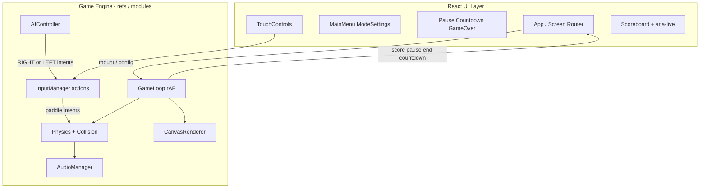

# Polished React Pong — Implementation Plan

## Locked decisions

| Decision | Choice | Why |
|---|---|---|
| Language | **TypeScript** | Safer game-state/AI/settings types; Vitest-friendly |
| Styling | **CSS Modules + CSS variables** | Scoped styles, no styling library |
| Rendering | **HTML Canvas + `requestAnimationFrame`** | Smooth gameplay without React-per-frame updates |
| Timestep | **Clamped variable dt** (max ~33ms) | Enough for Pong; simpler than fixed-step + interpolation |
| Audio | **Web Audio API oscillators** | No remote assets; unlock after first user gesture |
| Optional settings (v1) | Side preference, ball/paddle speed, acceleration, screen shake, center line | Useful without bloating menus |
| Deferred (post-v1) | Multiple themes / court skins | One polished retro-modern look first |
| Touch | Side buttons (required) + vertical drag (bonus) | Buttons for reliable 2P multi-touch |
| Delivery | **Phase-by-phase with confirmation** | Matches README; say “do all at once” if you want the full ship in one go |

---

## Technical architecture



**Core rule:** React owns screens, settings, and discrete events. The engine owns positions, velocities, and the rAF loop via refs/`useGameEngine`. Canvas redraws every frame; React re-renders only on score / pause / game-over / countdown / navigation.

Logical court size is fixed (e.g. **800×450**, 16:9). Canvas CSS scales to fit the viewport; drawing uses `devicePixelRatio`. Physics never depends on pixel size.

---

## Proposed file tree

```
pong-game/
  package.json
  vite.config.ts
  tsconfig.json
  index.html
  README.md                    # replace spec with user docs after Phase 6
  src/
    main.tsx
    App.tsx
    App.module.css
    vite-env.d.ts
    components/
      MainMenu.tsx
      ModeSelection.tsx
      SettingsPanel.tsx
      GameScreen.tsx
      GameCanvas.tsx
      Scoreboard.tsx
      PauseOverlay.tsx
      GameOverOverlay.tsx
      CountdownOverlay.tsx
      TouchControls.tsx
      OrientationNotice.tsx
      ConfirmDialog.tsx
    game/
      GameEngine.ts
      GameLoop.ts
      Physics.ts
      Collision.ts
      AIController.ts
      InputManager.ts
      AudioManager.ts
      Renderer.ts
      constants.ts
      types.ts
      aiConfig.ts
    hooks/
      useGameEngine.ts
      useKeyboardControls.ts
      usePointerControls.ts
      useLocalStorage.ts
      usePageVisibility.ts
      useOrientation.ts
    store/
      settings.ts              # defaults, parse, persist
      appState.ts              # screen + match config (React state)
    styles/
      global.css               # tokens, reset, focus, safe-area
      themes.css               # retro-modern palette variables
    utils/
      clamp.ts
      storage.ts
    __tests__/
      physics.test.ts
      collision.test.ts
      ai.test.ts
      settings.test.ts
```

No heavy game engine. Dependencies: `react`, `react-dom`, `vite`, `typescript`, `vitest` (+ `@testing-library` only if DOM tests are needed; prefer pure logic tests).

---

## Game-state model

**App screens:** `menu` → `mode` → `settings` (optional) → `ready` → `playing` | `paused` | `pointScored` → `gameOver`

**Engine match state** (mutable, not React):

```ts
type MatchState = {
  status: 'countdown' | 'playing' | 'paused' | 'point' | 'over'
  ball: { x, y, vx, vy, speed }
  left: { y, h, vyIntent }   // intent -1|0|1 from InputManager
  right: { y, h, vyIntent }
  score: { left, right }
  countdown: number | null
  winner: 'left' | 'right' | null
}
```

**Settings** (localStorage key e.g. `pong-settings-v1`):

- Mode: `onePlayer` | `twoPlayer`
- Difficulty: `easy` | `medium` | `hard`
- Keyboard scheme (1P): `arrows` | `wasd`
- Human side: `left` | `right`
- Winning score: `5` | `7` | `10` | `15` | `endless`
- Sound, reduced motion, touch controls visible
- Ball base speed, paddle speed, acceleration rate, screen shake, show center line

Safe `parseSettings(raw)` with defaults; ignore unknown keys; never persist live input.

---

## Input-control architecture

**Actions:** `LEFT_UP`, `LEFT_DOWN`, `RIGHT_UP`, `RIGHT_DOWN`, `PAUSE`, `CONFIRM`, `BACK`

`InputManager`:

- Keyboard: track pressed set; ignore auto-repeat; clear on `blur` / visibility hidden / pause / leave game
- Touch buttons: Pointer Events + `pointerId` map; press-and-hold; `pointerup` / `pointercancel` / `lostpointercapture`
- Optional drag: map pointer Y on a paddle’s half-court to paddle target (1P or each side in 2P)
- AI: writes the computer side’s up/down intents each frame (after human/touch merge, AI overwrites its paddle only)
- Only prevent default on game screen (arrow keys / space / touch scroll)

Desktop 2P: Left = W/S, Right = Arrows (shown on ready screen).  
1P: selected scheme on human side; AI on the other.

---

## Physics approach

- Move paddles with `y += intent * paddleSpeed * dt`; clamp to court
- Ball: `pos += vel * dt`; wall bounce (invert `vy`, clamp inside)
- **Paddle hit:** impact offset `(-1..1)` → outgoing angle (center = flat, edge = steep); optional tiny paddle-velocity bias; invert/set `vx` toward opponent; bump speed toward max
- **Anti-tunnel:** substeps when `speed * dt` is large, or swept AABB along motion; push ball out of paddle after hit; one-hit cooldown / “already bounced this side” flag
- Serve: center spawn; random direction with min `|vx|` so never near-vertical; short countdown (3-2-1) before first serve and after each point
- Score when ball crosses left/right edge; reset speed to base; check win unless endless

---

## Computer AI behavior

Target-Y based (never teleport). Shared paddle speed caps apply.

| | Easy | Medium | Hard |
|---|---|---|---|
| Reaction interval | long | medium | short |
| Max speed | slow | mid | fast (≤ human max) |
| Prediction | chase live Y | linear + 1 wall bounce | multi wall bounce |
| Error / mistakes | large + frequent | moderate | small / rare |
| Ball leaving | drift to center | defensive center | slight lead |

Config centralized in [`src/game/aiConfig.ts`](src/game/aiConfig.ts). Update target only on reaction timer; move toward target with max speed.

---

## Responsive / mobile strategy

- Court in a letterboxed flex area preserving 16:9; HUD/score above; touch pads left/right outside critical play area when possible
- `touch-action: none` on canvas + control zones; `overscroll-behavior: none` while playing
- Landscape recommendation + non-blocking portrait banner (`OrientationNotice`)
- Safe-area insets on controls; large hit targets (~48px+)
- Auto-pause on `document.visibilitychange` / `window.blur`
- Escape/P pause; R → confirm restart; mobile pause button always visible

---

## Visual / a11y / audio (Phase 5)

- Dark court, neon paddles/ball, dashed center line, large score digits, subtle glow (CSS/canvas)
- Reduced motion: skip shake, particles, trail, shorten countdown motion
- Semantic menus, focus rings, labels; score text + polite `aria-live` for “Player 1 scores” / “Player 2 wins” (not every frame)
- Canvas `role="img"` + accessible label; mute toggle; AudioContext resume on first click

---

## Edge cases (handled in design)

Stuck keys after blur; pointer cancel; resize mid-rally (keep logical coords); Strict Mode double-mount (single loop guard / cleanup); huge dt clamp; corner collisions; tunneling; invalid serve angles; rematch full reset; localStorage throw/unavailable; suspended AudioContext; rotate during play; leave menu while paused; no dual rAF loops.

---

## Implementation phases

### Phase 1 — Scaffold & navigation
Vite React-TS, global styles/tokens, screen router, MainMenu / ModeSelection / SettingsPanel (UI only), types, constants, settings defaults + localStorage helpers.

**Test:** navigate menus; change settings; refresh and see persistence.

### Phase 2 — Canvas, loop, physics
`GameCanvas`, `GameLoop`, `Physics`, `Collision`, `Renderer`, scoring + countdown overlays wired via engine events; pause skeleton.

**Test:** auto-play paddles or fixed intents; wall/paddle bounce; speed ramp; scoring; resize sharpness.

### Phase 3 — Keyboard + AI
`InputManager`, keyboard hook, 1P schemes, AI difficulties, human side preference.

**Test:** WASD/arrows; both keys held; Easy/Med/Hard feel different; Escape pause; tab hide auto-pause.

### Phase 4 — 2P + touch + mobile
Two-player mapping, `TouchControls`, multi-pointer, orientation notice, scroll lock, drag optional.

**Test:** two fingers both sides; portrait banner; no page scroll during play.

### Phase 5 — Polish
Audio, particles/shake/trail (gated), a11y live regions, ConfirmDialog for restart, visual finish.

### Phase 6 — Tests & docs
Vitest for physics/collision/AI target/settings parse; replace README with install/dev/build/test, controls, architecture, manual checklist; perf pass (no per-frame React setState, cleanup listeners).

After each phase: summary, file list, how to test, **wait for your OK** before the next phase.

---

## Manual test checklist (final)

Simultaneous keys; 2P multi-touch; resize; orientation; 60/120Hz feel; visibility pause; scroll prevention; pointer cancel; corrupted localStorage; reduced motion; rematch; audio mute after gesture.

## Scripts

```bash
npm install
npm run dev
npm run build
npm run test
```
